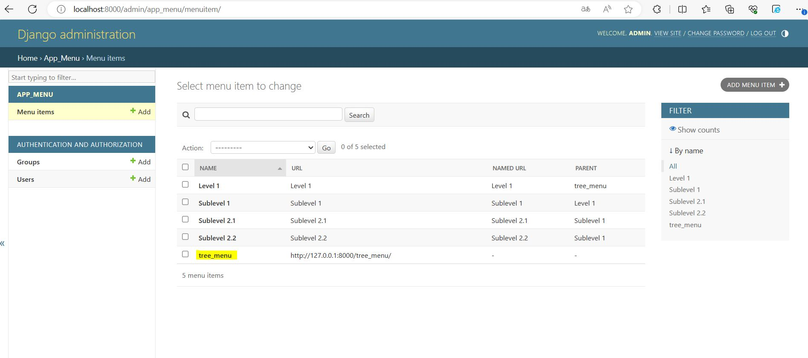
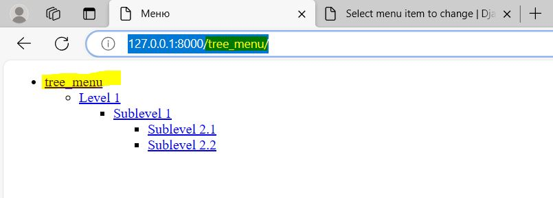

# tree_menu

## Реализация древовидного меню на Django

### ТЗ

```
Нужно сделать django app, который будет реализовывать древовидное меню, соблюдая следующие условия:

1) Меню реализовано через template tag
2) Все, что над выделенным пунктом - развернуто. Первый уровень вложенности под выделенным пунктом тоже развернут.
3) Хранится в БД.
4) Редактируется в стандартной админке Django
5) Активный пункт меню определяется исходя из URL текущей страницы
6) Меню на одной странице может быть несколько. Они определяются по названию.
7) При клике на меню происходит переход по заданному в нем URL. URL может быть задан как явным образом, так и через
   named url.
8) На отрисовку каждого меню требуется ровно 1 запрос к БД
   Нужен django-app, который позволяет вносить в БД меню (одно или несколько) через админку, и нарисовать на любой
   нужной странице меню по названию.
   
   При выполнении задания из библиотек следует использовать только Django и стандартную библиотеку Python.
   При решении тестового задания у вас не должно возникнуть вопросов. Если появляются вопросы, вероятнее всего, у вас
   недостаточно знаний.
   Задание выложить на гитхаб.
```

### Стек

- Python 3.10
- Django 5.0

### Запуск проекта в dev-режиме

Инструкция ориентирована на операционную систему windows и утилиту git bash.
Для прочих инструментов используйте аналоги команд для вашего окружения.

1. Клонируйте репозиторий и перейдите в него в командной строке:

```
git clone https://github.com/RomanKostikov/tree_menu.git
```

2. Установите и активируйте виртуальное окружение:

```
python -m venv venv
```

```
source venv/Scripts/activate
```

3. Установите зависимости из файла requirements.txt:

```
pip install -r requirements.txt
```

4. В папке с файлом manage.py выполните миграции:

```
python manage.py migrate
```

5. Создайте суперюзера, зайдите в админку:

```
python manage.py createsuperuser
```

6. В папке с файлом manage.py запустите сервер, выполнив команду:

```
python manage.py runserver
```

7. Перейдите в админку и добавьте несколько пунктов и подпунктов ваших меню
   (главное меню должно совпадать с переданным url Н: tree_main)
8. Открываем главную страницу и видим результат проделанной работ.

### Скриншоты выполненной работы

1. Admin панель django:
   
2. Отображение меню в браузере:
   

### Полезные источники:

1. https://docs.djangoproject.com/en/5.0/ref/templates/builtins/
2. https://ngangasn.com/create-custom-template-tags-in-django-a-complete-guide/
3. https://stackoverflow.com/